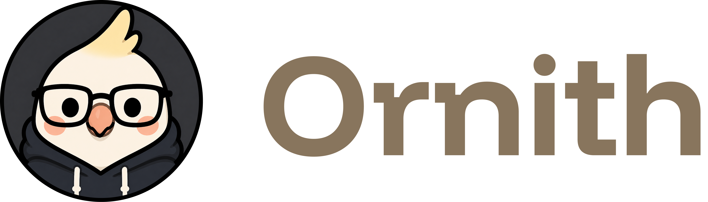
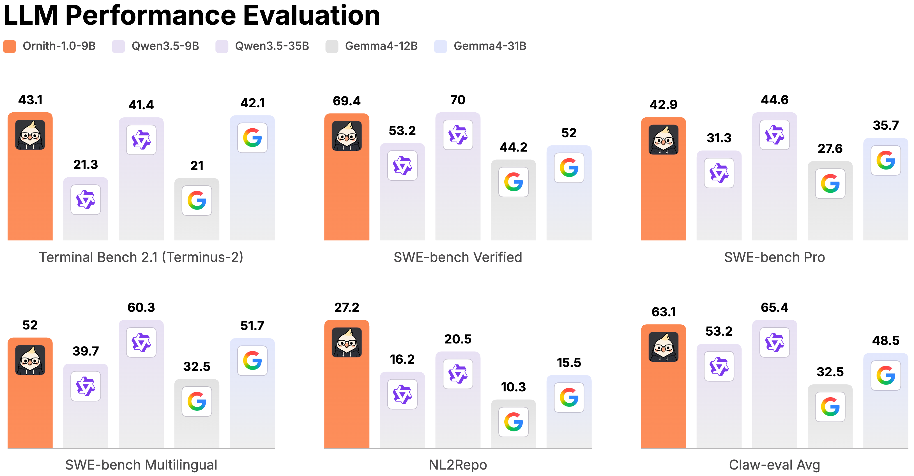

# Ornith-1



<div align="center">

</div>

[](https://deep-reinforce.com/ornith.html)


# Introduction


Aloha! 🌺 Today, we are releasing Ornith-1.0, a self-improving family of open-source models for agentic coding. 

Highlights: 

- **State-of-the-Art Coding Agents**: Available in 9B-Dense, 31B-Dense, 35B-MoE, and 397B-MoE (post-trained on top of Gemma 4 and Qwen 3.5), achieving state-of-the-art performance among open-source models of comparable size on coding benchmarks such as Terminal-Bench 2.1, SWE-Bench, NL2Repo and OpenClaw. 
- **Self-Improving Training Framework**:  Ornith-1.0 employs RL to learn to generate not only solution rollouts, but also the scallfold that drive those rollouts. By jointly optimizing the scaffold and the resulting solution, the model  discovers better search trajectories and generates higher-quality solutions. 
- **Licence**: MIT licensed, globally accessible, and free from regional limitations.



## Ornith 1.0 

This model card documents **Ornith-1.0-9B**, the most lightweight member of the Ornith family, designed for efficient single-GPU deployment.

### Benchmarks


<div style="font-family:-apple-system,BlinkMacSystemFont,'Segoe UI',Roboto,sans-serif;width:100%;margin:0 auto;padding:16px 0">
<table style="width:100%;table-layout:fixed;border-collapse:collapse;font-size:13px">
<thead><tr>
<th style="width:28%;padding:10px 7px;text-align:left;font-weight:600;border-bottom:2px solid #FD8E5B;color:#FD8E5B"></th><th style="width:14.4%;padding:10px 7px;text-align:center;font-weight:700;border-bottom:2px solid #FD8E5B;color:#FD8E5B;font-size:14px;background:rgba(253, 142, 91, 0.12)">Ornith-1.0-9B</th><th style="width:14.4%;padding:10px 7px;text-align:center;font-weight:500;border-bottom:2px solid #FD8E5B;color:#FD8E5B;font-size:14px;">Qwen3.5-9B</th><th style="width:14.4%;padding:10px 7px;text-align:center;font-weight:500;border-bottom:2px solid #FD8E5B;color:#FD8E5B;font-size:14px;">Qwen3.5-35B-A3B</th><th style="width:14.4%;padding:10px 7px;text-align:center;font-weight:500;border-bottom:2px solid #FD8E5B;color:#FD8E5B;font-size:14px;">Gemma4-12B</th><th style="width:14.4%;padding:10px 7px;text-align:center;font-weight:500;border-bottom:2px solid #FD8E5B;color:#FD8E5B;font-size:14px;">Gemma4-31B</th></tr></thead>
<tbody>
<tr><td colspan="6" style="padding:8px 12px;font-weight:600;color:#FD8E5B;border-bottom:1px solid rgba(253, 142, 91, 0.2);background:rgba(253, 142, 91, 0.1)">Agentic Coding</td></tr>
<tr>
<td style="padding:7px 7px;padding-left:20px;border-bottom:1px solid rgba(128, 128, 128, 0.15);">Terminal-Bench 2.1 <sub><small>(Terminus-2)</small></sub></td>
<td style="padding:7px 7px;text-align:center;border-bottom:1px solid rgba(128, 128, 128, 0.15);font-weight:600;color:#FD8E5B;background:rgba(253, 142, 91, 0.06)">43.1</td>
<td style="padding:7px 7px;text-align:center;border-bottom:1px solid rgba(128, 128, 128, 0.15)">21.3</td>
<td style="padding:7px 7px;text-align:center;border-bottom:1px solid rgba(128, 128, 128, 0.15)">41.4</td>
<td style="padding:7px 7px;text-align:center;border-bottom:1px solid rgba(128, 128, 128, 0.15)">21.0</td>
<td style="padding:7px 7px;text-align:center;border-bottom:1px solid rgba(128, 128, 128, 0.15)">42.1</td>
</tr>
<tr>
<td style="padding:7px 7px;padding-left:20px;border-bottom:1px solid rgba(128, 128, 128, 0.15);">SWE-bench Verified</td>
<td style="padding:7px 7px;text-align:center;border-bottom:1px solid rgba(128, 128, 128, 0.15);font-weight:600;color:#FD8E5B;background:rgba(253, 142, 91, 0.06)">69.4</td>
<td style="padding:7px 7px;text-align:center;border-bottom:1px solid rgba(128, 128, 128, 0.15)">53.2</td>
<td style="padding:7px 7px;text-align:center;border-bottom:1px solid rgba(128, 128, 128, 0.15)">70.0</td>
<td style="padding:7px 7px;text-align:center;border-bottom:1px solid rgba(128, 128, 128, 0.15)">44.2</td>
<td style="padding:7px 7px;text-align:center;border-bottom:1px solid rgba(128, 128, 128, 0.15)">52.0</td>
</tr>
<tr>
<td style="padding:7px 7px;padding-left:20px;border-bottom:1px solid rgba(128, 128, 128, 0.15);">SWE-bench Pro</td>
<td style="padding:7px 7px;text-align:center;border-bottom:1px solid rgba(128, 128, 128, 0.15);font-weight:600;color:#FD8E5B;background:rgba(253, 142, 91, 0.06)">42.9</td>
<td style="padding:7px 7px;text-align:center;border-bottom:1px solid rgba(128, 128, 128, 0.15)">31.3</td>
<td style="padding:7px 7px;text-align:center;border-bottom:1px solid rgba(128, 128, 128, 0.15)">44.6</td>
<td style="padding:7px 7px;text-align:center;border-bottom:1px solid rgba(128, 128, 128, 0.15)">27.6</td>
<td style="padding:7px 7px;text-align:center;border-bottom:1px solid rgba(128, 128, 128, 0.15)">35.7</td>
</tr>
<tr>
<td style="padding:7px 7px;padding-left:20px;border-bottom:1px solid rgba(128, 128, 128, 0.15);">SWE-bench Multilingual</td>
<td style="padding:7px 7px;text-align:center;border-bottom:1px solid rgba(128, 128, 128, 0.15);font-weight:600;color:#FD8E5B;background:rgba(253, 142, 91, 0.06)">52.0</td>
<td style="padding:7px 7px;text-align:center;border-bottom:1px solid rgba(128, 128, 128, 0.15)">39.7</td>
<td style="padding:7px 7px;text-align:center;border-bottom:1px solid rgba(128, 128, 128, 0.15)">60.3</td>
<td style="padding:7px 7px;text-align:center;border-bottom:1px solid rgba(128, 128, 128, 0.15)">32.5</td>
<td style="padding:7px 7px;text-align:center;border-bottom:1px solid rgba(128, 128, 128, 0.15)">51.7</td>
</tr>
<tr>
<td style="padding:7px 7px;padding-left:20px;border-bottom:1px solid rgba(128, 128, 128, 0.15);">NL2Repo</td>
<td style="padding:7px 7px;text-align:center;border-bottom:1px solid rgba(128, 128, 128, 0.15);font-weight:600;color:#FD8E5B;background:rgba(253, 142, 91, 0.06)">27.2</td>
<td style="padding:7px 7px;text-align:center;border-bottom:1px solid rgba(128, 128, 128, 0.15)">16.2</td>
<td style="padding:7px 7px;text-align:center;border-bottom:1px solid rgba(128, 128, 128, 0.15)">20.5</td>
<td style="padding:7px 7px;text-align:center;border-bottom:1px solid rgba(128, 128, 128, 0.15)">10.3</td>
<td style="padding:7px 7px;text-align:center;border-bottom:1px solid rgba(128, 128, 128, 0.15)">15.5</td>
</tr>
<tr>
<td style="padding:7px 7px;padding-left:20px;border-bottom:1px solid rgba(128, 128, 128, 0.15);">Claw-eval Avg</td>
<td style="padding:7px 7px;text-align:center;border-bottom:1px solid rgba(128, 128, 128, 0.15);font-weight:600;color:#FD8E5B;background:rgba(253, 142, 91, 0.06)">63.1</td>
<td style="padding:7px 7px;text-align:center;border-bottom:1px solid rgba(128, 128, 128, 0.15)">53.2</td>
<td style="padding:7px 7px;text-align:center;border-bottom:1px solid rgba(128, 128, 128, 0.15)">65.4</td>
<td style="padding:7px 7px;text-align:center;border-bottom:1px solid rgba(128, 128, 128, 0.15)">32.5</td>
<td style="padding:7px 7px;text-align:center;border-bottom:1px solid rgba(128, 128, 128, 0.15)">48.5</td>
</tr>
</tbody>
</table>
<p style="margin-top:12px;font-size:10px;opacity:0.7">
* Terminal-Bench 2.1: Harbor/Terminus-2, 3h timeout, 32 CPU / 48GB RAM, avg of 5 runs.<br/>
* All SWE-Bench：Mini-SWE-Agent, temp=1.0, top_p=0.95, 200K context window.<br/>
* NL2Repo：400K context, 48k output, anti-hacking filters.<br/>
* ClawEval: An agentic code benchmark over real-user task distributions; temp=0.6, 256K context.<br/>
</p>

</div>

## Quickstart

<div style="border-left:4px solid #FD8E5B;background:rgba(253,142,91,0.1);border-radius:6px;padding:12px 16px;font-family:-apple-system,BlinkMacSystemFont,'Segoe UI',Roboto,sans-serif;font-size:14px;line-height:1.6">
<div style="font-weight:700;color:#FD8E5B;margin-bottom:6px">📝 NOTE</div>
<p style="margin:0 0 10px"><b>Ornith-1.0-9B</b> is a <b>reasoning model</b>: by default the assistant turn opens with a <code style="background:rgba(253,142,91,0.15);padding:1px 5px;border-radius:4px">&lt;think&gt; … &lt;/think&gt;</code> block before the final answer. The serving recipes below enable a reasoning parser so the chain-of-thought is returned in a separate <code style="background:rgba(253,142,91,0.15);padding:1px 5px;border-radius:4px">reasoning_content</code> field, and a tool-call parser so the model's <code style="background:rgba(253,142,91,0.15);padding:1px 5px;border-radius:4px">&lt;tool_call&gt;</code> blocks are surfaced as OpenAI-style <code style="background:rgba(253,142,91,0.15);padding:1px 5px;border-radius:4px">tool_calls</code>.</p>
<p style="margin:0 0 6px">Serving Ornith-1.0-9B requires recent runtimes:</p>
<ul style="margin:0 0 10px;padding-left:20px">
<li><b>Transformers</b> ≥ 5.8.1</li>
<li><b>vLLM</b> ≥ 0.19.1</li>
<li><b>SGLang</b> ≥ 0.5.9</li>
</ul>
<p style="margin:0">Recommended sampling parameters: <code style="background:rgba(253,142,91,0.15);padding:1px 5px;border-radius:4px">temperature=0.6</code>, <code style="background:rgba(253,142,91,0.15);padding:1px 5px;border-radius:4px">top_p=0.95</code>, <code style="background:rgba(253,142,91,0.15);padding:1px 5px;border-radius:4px">top_k=20</code> (use <code style="background:rgba(253,142,91,0.15);padding:1px 5px;border-radius:4px">temperature=1.0</code> to reproduce the reported benchmark setup).</p>
</div>


### Serving Ornith-1.0-9B

Ornith-1.0-9B is a dense ~9B model (≈19 GB in bf16), so it serves comfortably on a **single 80GB GPU**. The recipes below stand up an OpenAI-compatible server; add `--tensor-parallel-size` / `--tp` if you want to shard across more GPUs.

#### vLLM

```bash
vllm serve deepreinforce-ai/Ornith-1.0-9B \
    --served-model-name Ornith-1.0-9B \
    --host 0.0.0.0 --port 8000 \
    --max-model-len 262144 \
    --gpu-memory-utilization 0.90 \
    --enable-prefix-caching \
    --enable-auto-tool-choice --tool-call-parser qwen3_xml \
    --reasoning-parser qwen3 \
    --trust-remote-code
```

#### SGLang

```bash
python -m sglang.launch_server \
    --model-path deepreinforce-ai/Ornith-1.0-9B \
    --served-model-name Ornith-1.0-9B \
    --host 0.0.0.0 --port 8000 \
    --context-length 262144 \
    --mem-fraction-static 0.85 \
    --tool-call-parser qwen3_coder \
    --reasoning-parser qwen3
```

#### Hugging Face Transformers

For a quick local test (or to script offline generation), load the model directly with Transformers. Make sure you have a recent release installed — see the [Transformers installation guide](https://huggingface.co/docs/transformers/installation); Ornith-1.0-9B requires `transformers >= 5.8.1`.

```python
from transformers import AutoModelForCausalLM, AutoTokenizer

model_name = "deepreinforce-ai/Ornith-1.0-9B"

tokenizer = AutoTokenizer.from_pretrained(model_name)
model = AutoModelForCausalLM.from_pretrained(
    model_name,
    dtype="auto",
    device_map="auto",
)

messages = [
    {"role": "user", "content": "Write a Python function is_prime(n). Keep it short."}
]
text = tokenizer.apply_chat_template(
    messages,
    tokenize=False,
    add_generation_prompt=True,
)

inputs = tokenizer(text, return_tensors="pt").to(model.device)
generated = model.generate(
    **inputs,
    max_new_tokens=512,
    do_sample=True,
    temperature=0.6,
    top_p=0.95,
    top_k=20,
)
output_ids = generated[0][inputs.input_ids.shape[1]:]

# The reply contains a <think> ... </think> reasoning block followed by the answer.
content = tokenizer.decode(output_ids, skip_special_tokens=True)
print(content)
```

To split the reasoning trace from the final answer, parse on the `</think>` marker:

```python
text = tokenizer.decode(output_ids, skip_special_tokens=True)
if "</think>" in text:
    reasoning, answer = text.split("</think>", 1)
    reasoning = reasoning.replace("<think>", "").strip()
    answer = answer.strip()
else:
    reasoning, answer = "", text.strip()
```

### Using Ornith-1.0-9B via the Chat Completions API

Once a vLLM or SGLang server is running, talk to it with any OpenAI-compatible client.

#### Basic Usage

```python
from openai import OpenAI

client = OpenAI(
    base_url="http://localhost:8000/v1",
    api_key="EMPTY",  # any non-empty string works for a local server
)

response = client.chat.completions.create(
    model="Ornith-1.0-9B",
    messages=[
        {"role": "user", "content": "Write a one-line Python lambda that squares a number."}
    ],
    temperature=0.6,
    top_p=0.95,
    max_tokens=1024,
)

message = response.choices[0].message
# reasoning_content holds the <think> trace; content holds the final answer.
print("reasoning:", getattr(message, "reasoning_content", None))
print("answer:", message.content)
```

You can also stream tokens, or hand the model tools — Ornith-1.0-9B emits well-formed function calls that the server parses into the standard `tool_calls` field:

```python
tools = [
    {
        "type": "function",
        "function": {
            "name": "get_weather",
            "description": "Get the current weather for a city",
            "parameters": {
                "type": "object",
                "properties": {"city": {"type": "string"}},
                "required": ["city"],
            },
        },
    }
]

response = client.chat.completions.create(
    model="Ornith-1.0-9B",
    messages=[{"role": "user", "content": "What is the weather in Paris right now?"}],
    tools=tools,
    tool_choice="auto",
    temperature=0.6,
    max_tokens=2048,
)

tool_call = response.choices[0].message.tool_calls[0]
print(tool_call.function.name, tool_call.function.arguments)
# -> get_weather {"city": "Paris"}
```

You can point any OpenAI-compatible SDK (Python, Node.js, etc.) or `curl` at the same `/v1/chat/completions` endpoint.

## Agentic Usage


### Agent Frameworks

Because Ornith-1.0-9B exposes an OpenAI-compatible endpoint with tool calling, it works out of the box with standard agent frameworks. Below is a minimal example that connects Ornith-1.0-9B to tools through an MCP server.

```python

```

**Examples of using Ornith with agent harness:**

#### Hermes Agent
```bash

```

#### OpenHands
```bash

```

#### llama.cpp / Ollama
```bash

```

#### Unsloth Studio

```bash

```


#### OpenClaw

```bash

```


### Coding CLIs


#### OpenCode
```bash

```

### Citation

If you find our work helpful, feel free to give us a cite.

```bibtex
@misc{ornith_9b,
    title = {{Ornith-1.0}: Agentic Coding, Open to All},
    url = {https://deep-reinforce.com/ornith_1_0.html},
    author = {{DeepReinforce Team}},
    year = {2026}
}
```